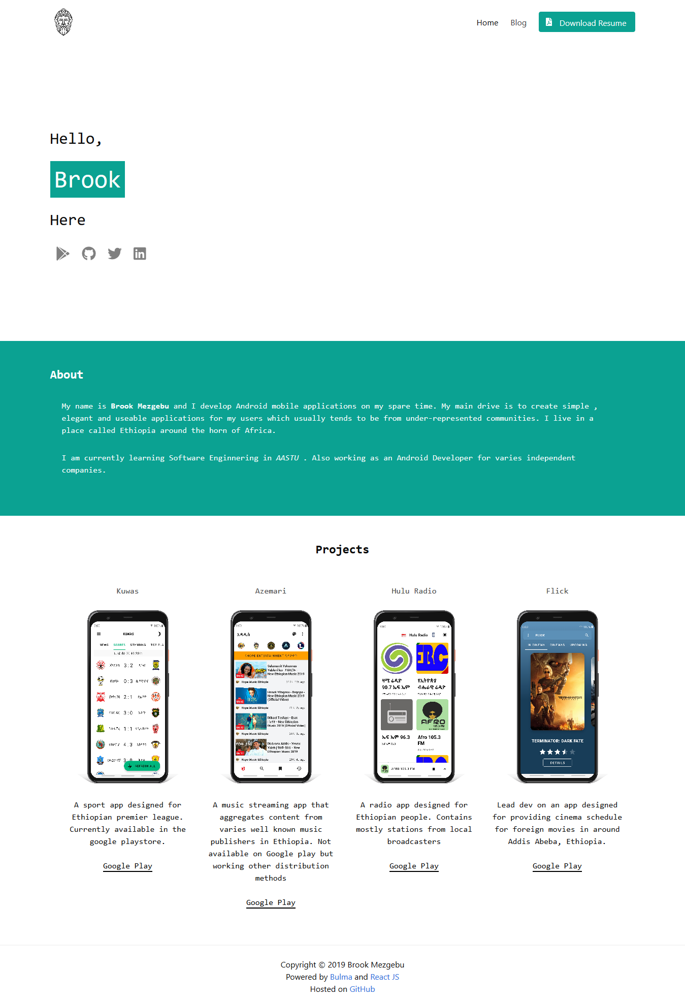

# Portfolio
#### A Website made with React to serve as a portfolio SWA for _moi_.

This project was bootstrapped with [Create React App](https://github.com/facebook/create-react-app).

### `Features`
* Basic home page consisting of about and projects list
* Blog section to preview content posted about my products
* Access to resume as a pdf file with a single button click
* React route for single page functionality

### `Preview`

<p align="center">
    <br />
    
</p>

### `Contribution`
* Fork the repo
* Create a new branch `git checkout -b '$username_$feature'`
* Make small changes
* Open a pull request 😊

### `Inspiration`
 This portfolio page is highly inspired by the works of Pavel Rekun. His design is what mostly drove me to make this web app.
 `If You are reading this, Thanks.`

### `License`
```
Copyright (C) 2019 Brook Mezgebu

Licensed under the Apache License, Version 2.0 (the "License");
you may not use this file except in compliance with the License.
You may obtain a copy of the License at

	http://www.apache.org/licenses/LICENSE-2.0

Unless required by applicable law or agreed to in writing, software
distributed under the License is distributed on an "AS IS" BASIS,
WITHOUT WARRANTIES OR CONDITIONS OF ANY KIND, either express or implied.
See the License for the specific language governing permissions and
limitation
